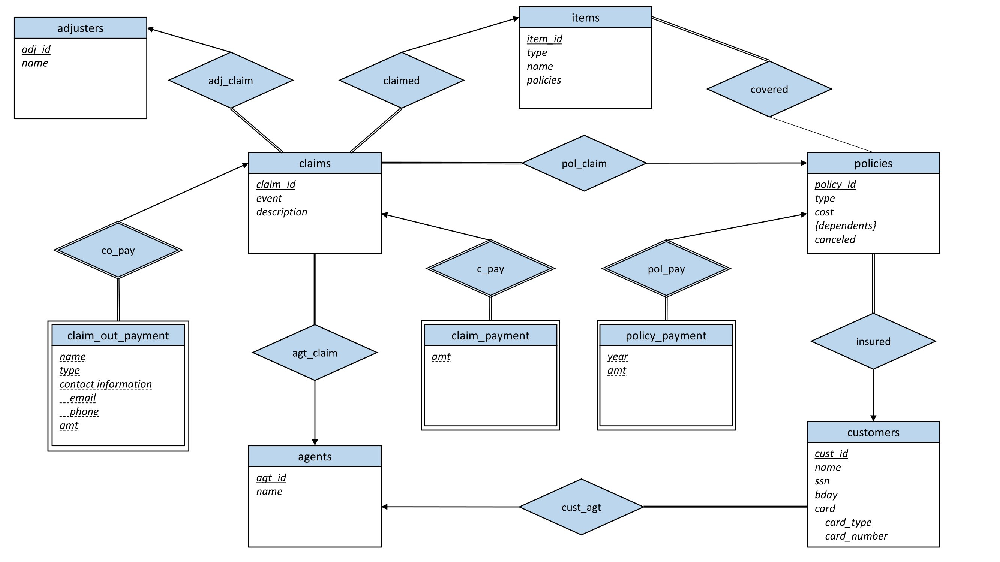

# County Garden

County Garden is a MySQL Relational Database for an insurance company, County Garden. This was a college project for the class "Database Systems, Algorithms, and Applications".

- Design the ER Diagram and create the tables.
- Code the command line interface for cusomters, agents, and adjusters.
- Setup the MySQL Server on a Docker container.

## Entity Relationship (ER) Diagram



## Data Generation

I used [Mockaroo](https://www.mockaroo.com/) to generate most of my data while doing some manual entry.

## User Interface

My interface uses menus to allow the user to navigate the data, when viewing any particular piece of data options will appear at the bottom for further navigation.
For example when on the customer view you can either view all customers, view a single customer, or return to the select interface menu.
You can switch between those menus using the assigned numbers given.
For each menu there is a back selection at the bottom which allows the user to return the last menu until they return to the select interface menu where they can then quit the program.

## Getting Started

This project uses a containerized MySQL Server. This requries a Docker daemon to be running. I recommend using [Docker Desktop](https://www.docker.com/products/docker-desktop/), once launched run the following commands in your terminal to setup the database.

### Pull latest MySQL Docker Image

```sh
docker pull mysql:8
```

### Run MySQL Server

```sh
docker run --name county-garden-mysql -p 3100:3306 -v C:/Users/larth/Coding/county-garden/data/dump.sql:/docker-entrypoint-initdb.d/dump.sql -e MYSQL_ROOT_PASSWORD=password -e MYSQL_DATABASE=county_garden -d mysql:8
```

### Run JAR

```sh
java -jar project.jar
```

### *Rebuilding the JAR*

If the existing `project.jar` isn't working you can rebuild the jar using the following commands.

```sh
javac src/*.java -d build
```

```sh
jar cvmf Manifest.txt project.jar -C build .
```

## Suggested Use

I would suggest navigating to the customer interface and either creating a new customer or use an exising account.
From their you will be able to naviagte the different aspects of the customer such as the policies they have what claims they have made and what items are insured.
After using all the customer naviagtion I suggest checking the adjuster and agent views and see how the data differs from their view.

## Clean Up

### Shutdown MySQL Server

```sh
docker stop county-garden-mysql
```

### Remove Docker Container

```sh
docker rm county-garden-mysql
```

### Remove MySQL 8 Docker Image

```sh
docker rmi mysql:8
```

